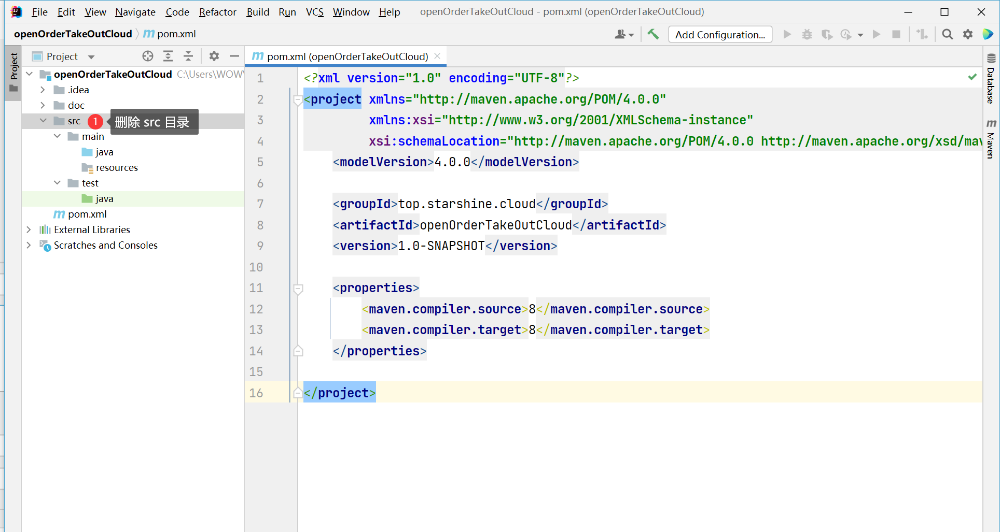

# 新建 maven 父项目

### 选择 maven 项目


### 项目信息填写


# 父项目初始化

## 删除 src 目录



## 打开 pom.xml 包管理文件，导入包版本管理

> 复制粘贴即可，不要做多余的动作

```xml
    <!--把springboot当做父工程-->
    <parent>
        <groupId>org.springframework.boot</groupId>
        <artifactId>spring-boot-starter-parent</artifactId>
        <version>2.5.14</version>
    </parent>

    <!--版本管理-->
    <properties>
        <maven.compiler.source>8</maven.compiler.source>
        <maven.compiler.target>8</maven.compiler.target>
        <mysql.version>8.0.28</mysql.version>
        <mybatis.plus.version>3.4.2</mybatis.plus.version>
        <lombok.version>1.18.22</lombok.version>
        <!-- Spring Cloud 2020.0.4 依赖 -->
        <spring-cloud.version>2020.0.5</spring-cloud.version>
        <!-- spring cloud alibaba 依赖 -->
        <spring-cloud-alibaba.version>2.2.7.RELEASE</spring-cloud-alibaba.version>
    </properties>

    <!--
     包管理：
     项目依赖管理 父项目只是声明依赖，父工程不会去下载，只是管理
     目的：是让子类在依赖的时候自动去下载的。
     一句话：让子类达到一种按需选中依赖的一种机制
     好处就是：不需要指定版本号。
 -->
    <dependencyManagement>
        <dependencies>

            <!--分布式锁，Redis版本 -->
            <dependency>
                <groupId>org.redisson</groupId>
                <artifactId>redisson</artifactId>
                <version>3.12.0</version>
            </dependency>

            <!-- Ok http-->
            <dependency>
                <groupId>com.squareup.okhttp3</groupId>
                <artifactId>okhttp</artifactId>
                <version>4.9.0</version>
            </dependency>

            <!--上下文-->
            <dependency>
                <groupId>com.alibaba.spring</groupId>
                <artifactId>spring-context-support</artifactId>
                <version>1.0.11</version>
            </dependency>

            <!--Rabbit MQ 消息管理-->
            <!-- https://mvnrepository.com/artifact/org.springframework.boot/spring-boot-starter-amqp -->
            <dependency>
                <groupId>org.springframework.boot</groupId>
                <artifactId>spring-boot-starter-amqp</artifactId>
                <version>2.5.10</version>
            </dependency>

            <!-- spring Boot web 包  -->
            <!--<dependency>-->
            <!--    <groupId>org.springframework.boot</groupId>-->
            <!--    <artifactId>spring-boot-starter-web</artifactId>-->
            <!--    <version>2.5.10</version>-->
            <!--</dependency>-->

            <!-- nacos 配置中心-->
            <!--<dependency>-->
            <!--    <groupId>com.alibaba.cloud</groupId>-->
            <!--    <artifactId>spring-cloud-starter-alibaba-nacos-config</artifactId>-->
            <!--    <version>2.2.7.RELEASE</version>-->
            <!--</dependency>-->

            <!-- AOP 依赖 -->
            <dependency>
                <groupId>org.springframework.boot</groupId>
                <artifactId>spring-boot-starter-aop</artifactId>
                <version>2.5.10</version>
            </dependency>

            <!-- @Test 注解 -->
            <dependency>
                <groupId>org.springframework.boot</groupId>
                <artifactId>spring-boot-starter-test</artifactId>
                <version>2.5.10</version>
            </dependency>

            <!--数据库驱动-->
            <dependency>
                <groupId>mysql</groupId>
                <artifactId>mysql-connector-java</artifactId>
                <version>${mysql.version}</version>
            </dependency>

            <!-- druid 德鲁伊 数据库链接池 -->
            <dependency>
                <groupId>com.alibaba</groupId>
                <artifactId>druid-spring-boot-starter</artifactId>
                <version>1.2.11</version>
                <exclusions>
                    <exclusion>
                        <groupId>com.sun</groupId>
                        <artifactId>tools</artifactId>
                    </exclusion>
                    <exclusion>
                        <groupId>com.sun</groupId>
                        <artifactId>jconsole</artifactId>
                    </exclusion>
                </exclusions>
            </dependency>

            <!--MyBatisPlus-->
            <dependency>
                <groupId>com.baomidou</groupId>
                <artifactId>mybatis-plus-boot-starter</artifactId>
                <version>${mybatis.plus.version}</version>
            </dependency>

            <!--pojo类偷懒注释支持-->
            <dependency>
                <groupId>org.projectlombok</groupId>
                <artifactId>lombok</artifactId>
                <version>${lombok.version}</version>
            </dependency>

            <!-- 开启 validation 注解注入时判断 -->
            <dependency>
                <groupId>org.springframework.boot</groupId>
                <artifactId>spring-boot-starter-validation</artifactId>
                <version>2.7.0</version>
            </dependency>

            <!-- minio 文件上传依赖 -->
            <dependency>
                <groupId>io.minio</groupId>
                <artifactId>minio</artifactId>
                <version>7.1.0</version>
            </dependency>

            <!-- UserAgentUtils 解析请求头中的信息-->
            <dependency>
                <groupId>eu.bitwalker</groupId>
                <artifactId>UserAgentUtils</artifactId>
                <version>1.21</version>
            </dependency>

            <!-- yml/yaml/properties 提示-->
            <dependency>
                <groupId>org.springframework.boot</groupId>
                <artifactId>spring-boot-configuration-processor</artifactId>
                <version>2.5.10</version>
            </dependency>

            <!--fastjson依赖-->
            <dependency>
                <groupId>com.alibaba</groupId>
                <artifactId>fastjson</artifactId>
                <version>1.2.33</version>
            </dependency>

            <!-- Bean 转化使用工具类 -->
            <dependency>
                <groupId>org.mapstruct</groupId>
                <artifactId>mapstruct</artifactId>
                <version>1.4.2.Final</version>
                <scope>compile</scope>
            </dependency>
            <dependency>
                <groupId>org.mapstruct</groupId>
                <artifactId>mapstruct-processor</artifactId>
                <version>1.4.2.Final</version>
                <scope>compile</scope>
            </dependency>

            <!--redis  -->
            <dependency>
                <groupId>org.springframework.boot</groupId>
                <artifactId>spring-boot-starter-data-redis</artifactId>
                <version>2.5.10</version>
            </dependency>

            <!-- JWT生成器 -->
            <dependency>
                <groupId>com.auth0</groupId>
                <artifactId>java-jwt</artifactId>
                <version>3.18.2</version>
            </dependency>

            <!--日期和时间库-->
            <dependency>
                <groupId>joda-time</groupId>
                <artifactId>joda-time</artifactId>
                <version>2.10.8</version>
            </dependency>

            <!--阿帕奇 http 请求-->
            <dependency>
                <groupId>org.apache.httpcomponents</groupId>
                <artifactId>httpclient</artifactId>
                <version>4.5.7</version>
            </dependency>

            <!-- spring cloud 依赖 -->
            <dependency>
                <groupId>org.springframework.cloud</groupId>
                <artifactId>spring-cloud-dependencies</artifactId>
                <version>${spring-cloud.version}</version>
                <type>pom</type>
                <scope>import</scope>
            </dependency>

            <!-- spring cloud alibaba 依赖 -->
            <dependency>
                <groupId>com.alibaba.cloud</groupId>
                <artifactId>spring-cloud-alibaba-dependencies</artifactId>
                <version>${spring-cloud-alibaba.version}</version>
                <type>pom</type>
                <scope>import</scope>
            </dependency>

            <!-- 支付宝支付 SDK -->
            <!-- https://mvnrepository.com/artifact/com.alipay.sdk/alipay-sdk-java -->
            <dependency>
                <groupId>com.alipay.sdk</groupId>
                <artifactId>alipay-sdk-java</artifactId>
                <version>4.9.28.ALL</version>
            </dependency>

            <!--公共模块-->
            <dependency>
                <groupId>top.starshine.cloud</groupId>
                <artifactId>ss-common</artifactId>
                <version>1.0-SNAPSHOT</version>
            </dependency>


        </dependencies>
    </dependencyManagement>
```

# 创建网关项目


# 类似如此创建如下微服务

- 用户服务 ss-user
- 产品服务 ss-product
- 订单服务 ss-order
- 支付服务 ss-payment
- 公共服务 ss-common
- 优惠券服务 ss-coupon
- 登录服务 ss-login
- 购物车服务 ss-shoppoingcart
- 网关服务 ss-gateway

## 共 9个微服务, 包含前端页面

> 我已准备好在同目录下的，方便搭建不用这么麻烦