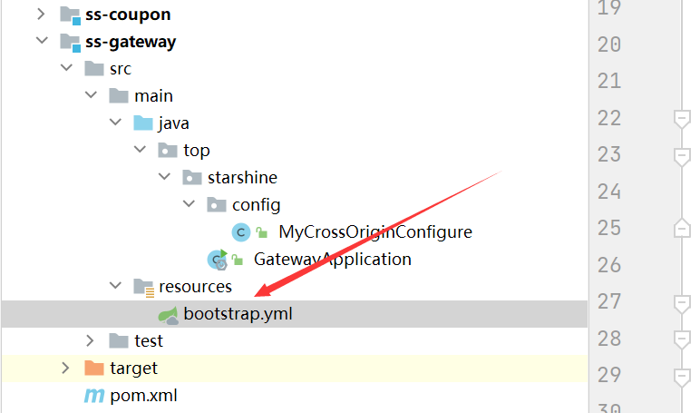
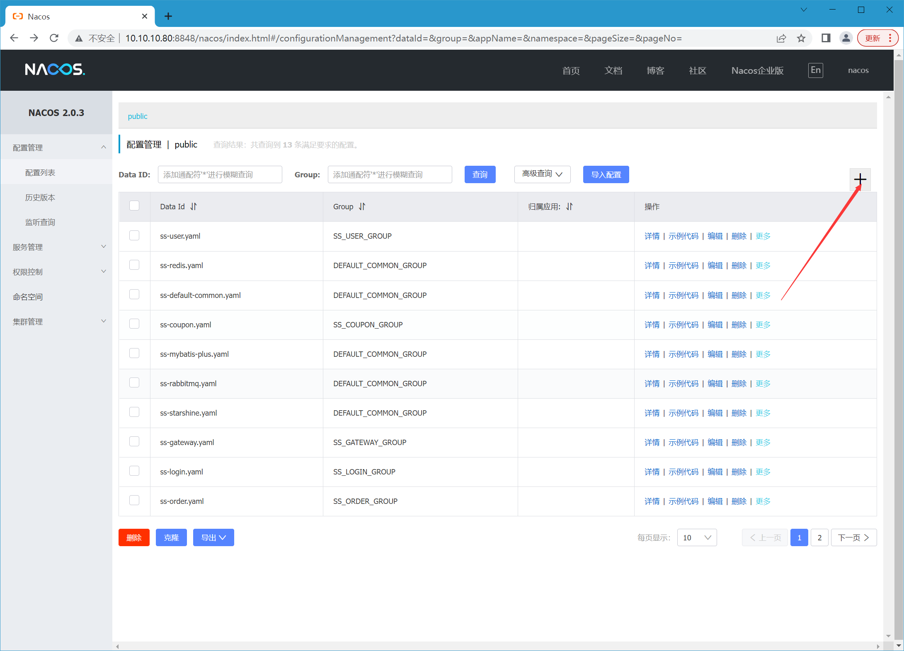
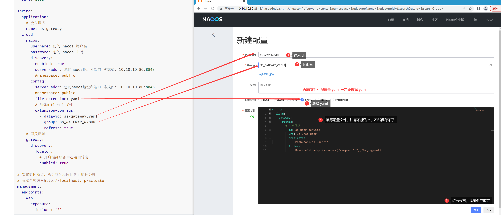
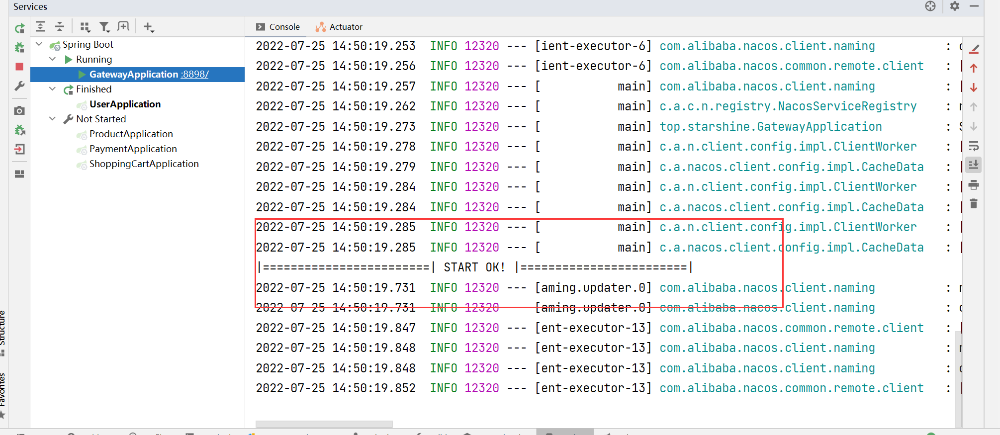
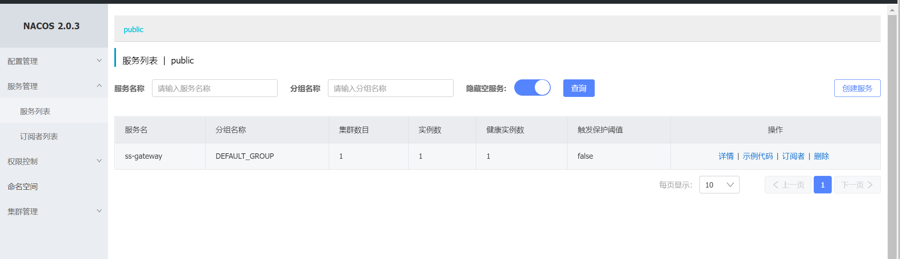

# 网关初始化

## pom.xml 导入包

```xml
<?xml version="1.0" encoding="UTF-8"?>
<project xmlns="http://maven.apache.org/POM/4.0.0"
         xmlns:xsi="http://www.w3.org/2001/XMLSchema-instance"
         xsi:schemaLocation="http://maven.apache.org/POM/4.0.0 http://maven.apache.org/xsd/maven-4.0.0.xsd">
    <parent>
        <artifactId>openOrderTakeOutCloud</artifactId>
        <groupId>top.starshine.cloud</groupId>
        <version>1.0-SNAPSHOT</version>
    </parent>
    <modelVersion>4.0.0</modelVersion>

    <artifactId>ss-gateway</artifactId>

    <properties>
        <maven.compiler.source>8</maven.compiler.source>
        <maven.compiler.target>8</maven.compiler.target>
    </properties>

    <dependencies>

        <!-- 服务健发现与注册 -->
        <dependency>
            <groupId>com.alibaba.cloud</groupId>
            <artifactId>spring-cloud-starter-alibaba-nacos-discovery</artifactId>
            <!-- 排除ribbon的依赖 -->
            <exclusions>
                <exclusion>
                    <groupId>org.springframework.cloud</groupId>
                    <artifactId>spring-cloud-starter-netflix-ribbon</artifactId>
                </exclusion>
            </exclusions>
        </dependency>

        <!-- 配置中 nacos -->
        <dependency>
            <groupId>com.alibaba.cloud</groupId>
            <artifactId>spring-cloud-starter-alibaba-nacos-config</artifactId>
        </dependency>

        <!--最新的 alibabacloud 在加载 bootstrap.yml文件的会报错-->
        <dependency>
            <groupId>org.springframework.cloud</groupId>
            <artifactId>spring-cloud-starter-bootstrap</artifactId>
        </dependency>

        <dependency>
            <groupId>org.springframework.cloud</groupId>
            <artifactId>spring-cloud-starter-gateway</artifactId>
        </dependency>

        <!--负载均衡 lbd调用服务需要依赖-->
        <!--参考地址: https://blog.csdn.net/weixin_45118010/article/details/125725715-->
        <dependency>
            <groupId>org.springframework.cloud</groupId>
            <artifactId>spring-cloud-starter-loadbalancer</artifactId>
        </dependency>

    </dependencies>

</project>
```

## 新建 bootstrap.xml

> 在 resources 下创建



## 配置 bootstrap.xml

```yaml
server:
  # 配置端口
  port: 8898

spring:
  application:
    # 会员服务
    name: ss-gateway
  cloud:
    nacos:
      username: 您的 nacos 用户名
      password: 您的 nacos 密码
      discovery:
        enabled: true
        server-addr: 您的naocs地址和端口 格式如: 10.10.10.80:8848
        #namespace: public
      config:
        server-addr: 您的naocs地址和端口 格式如: 10.10.10.80:8848
        #namespace: public
        file-extension: yaml
        # 加载配置中心的文件
        extension-configs:
          - data-id: ss-gateway.yaml
            group: SS_GATEWAY_GROUP
            refresh: true
    # 网关配置
    gateway:
      discovery:
        locator:
          # 开启根据服务中心路由转发
          enabled: true
```

## Nacos 中心配置 ss-gateway.yaml





## 配置含义

> 注意：这里要记得配置正确，否则后续创建用户服务直接访问，不在赘述如何配置网关

```yaml
# 用户服务
- id: ss_user_service
	# 转发目标服务名 ss-user 
	uri: lb://ss-user 
    predicates:
    	# 匹配地址包含 http://localhost:88989/api/ss-user/** 即转发到 http://ss-user:8100/**
		- Path=/api/ss-user/**
	filters:
		# 过滤器：将 客户端访问的 /api/ss-user/** , 截取并替换成 /** , 也就是去掉 /api/ss-user
		- RewritePath=/api/ss-user/(?<segment>.*),/$\{segment}
```

## 创建启动类

```java
package top.starshine;

import org.springframework.boot.SpringApplication;
import org.springframework.boot.autoconfigure.SpringBootApplication;

/**
 * <h3>网关启动类</h3>
 *
 * @author: starshine
 * @email: 183101655@qq.com
 * @version: 1.0
 * @since: 2022/7/24  下午 11:04  周日
 * @Description: hello world
 */
@SpringBootApplication
public class GatewayApplication {

    public static void main(String[] args) {
        SpringApplication.run(GatewayApplication.class, args);
        System.out.println("|========================| START OK! |========================|");
    }

}
```

## 配置跨域

```java
package top.starshine.config;


import org.springframework.context.annotation.Bean;
import org.springframework.context.annotation.Configuration;
import org.springframework.web.cors.CorsConfiguration;
import org.springframework.web.cors.reactive.CorsWebFilter;
import org.springframework.web.cors.reactive.UrlBasedCorsConfigurationSource;

/**
 * <h3>跨域配置</h3>
 *
 * @author: starshine
 * @email: 183101655@qq.com
 * @version: 1.0
 * @since: 2022/7/24  下午 5:23  周日
 * @Description: hello world
 */
@Configuration
public class MyCrossOriginConfigure {

    /**
     * 配置跨域
     * @return 跨域配置对象
     */
    @Bean
    public CorsWebFilter corsFilter() {
        CorsConfiguration config = new CorsConfiguration();
        config.addAllowedOriginPattern("*");// 允许所有域名进行跨域调用
        config.setAllowCredentials(true);// 允许跨越发送cookie
        config.addAllowedHeader("*");// 放行全部原始头信息
        config.addAllowedMethod("*");// 允许所有请求方法跨域调用
        config.addExposedHeader("*");// 添加响应头
        UrlBasedCorsConfigurationSource source = new UrlBasedCorsConfigurationSource();
        source.registerCorsConfiguration("/**", config);// 所有路径都允许跨域
        return new CorsWebFilter(source);
    }

}
```

## 启动运行网关，测试是否能成功运行

> 启动成功就显示如下



