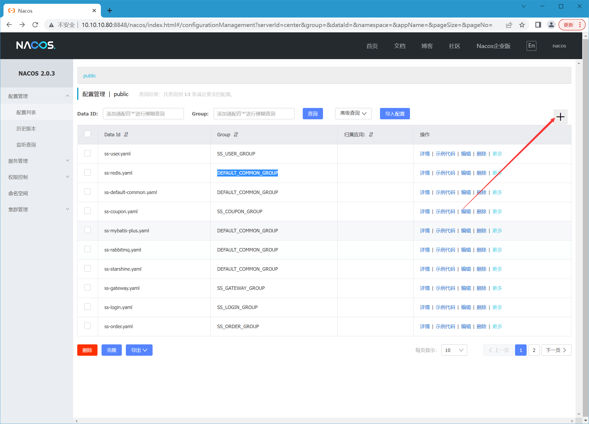
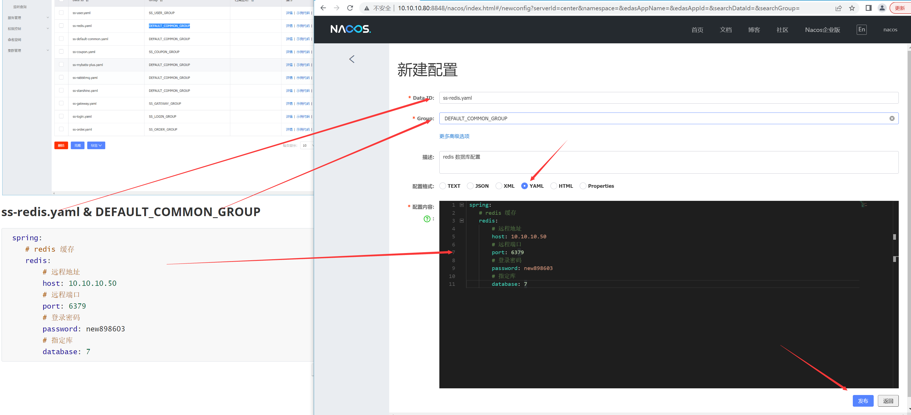
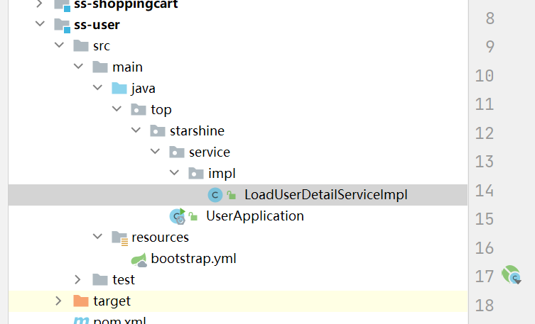
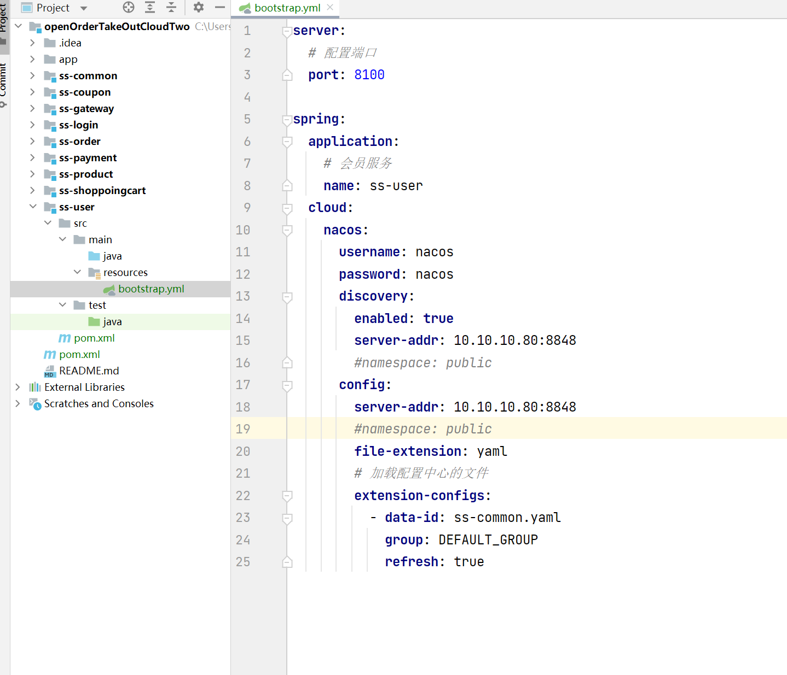
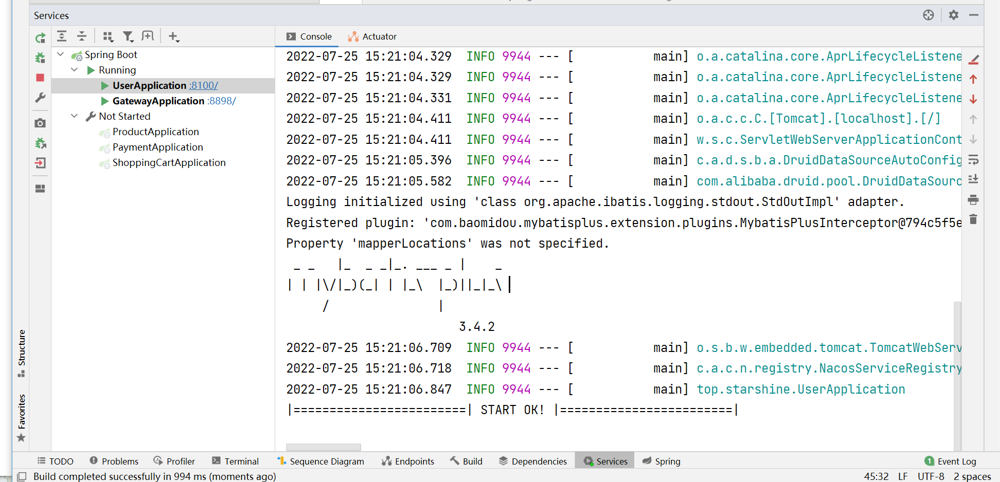
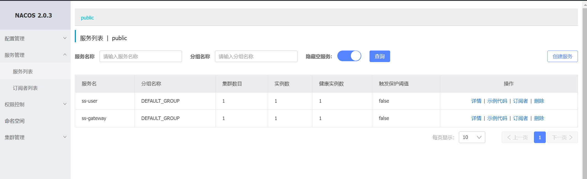
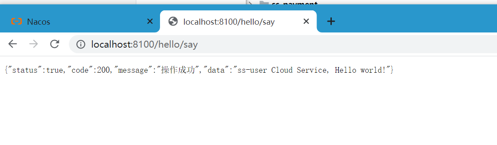
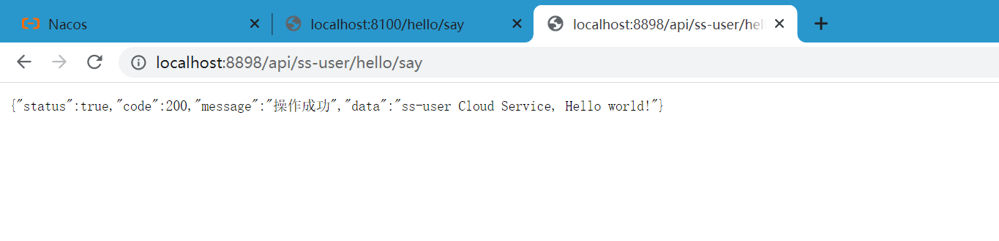

# 所有微服务初始化

## 注意：必须有如下软件才能启动，请安装好后操作

- mysql 数据库 5.6版本以上
- redis 数据库 
- rabbit MQ 消息队列
- nacos 阿里巴巴配置和注册中心 2.x 版本以上


## 配置中心创建公共配置文件

### 配置示例





## 详情配置如下

```yaml
# 服务配置
server:
  # 开启 tomcat 的 gzip
  compression:
    enabled: true
    min-response-size: 1024
  # 配置 tomcat
  tomcat:
    uri-encoding: UTF-8
    #tomcat默认限制文件上传的大小是2MB ，超过就不会被捕获，需要调整大一点或者-1不限制
    max-swallow-size: -1

spring:
  # 配置链接数据库
  datasource:
    type: com.alibaba.druid.pool.DruidDataSource
    driver-class-name: com.mysql.cj.jdbc.Driver
    # 数据库地址
    url: jdbc:mysql://10.10.10.51:3306/open_order_take_out?useUnicode=true&characterEncoding=utf8&useSSL=false
    username: 
    password: 
  # 消息队列
  rabbitmq:
      host: 
      port: 5672
      username: 
      password: 
      virtual-host: /
  # redis 缓存
  redis:
      # 远程地址
      host: 
      # 远程端口
      port: 6379
      # 登录密码
      password: 
      # 指定库
      database: 7
  # 设置 jackson 日期时间
  jackson:
      date-format: yyyy-MM-dd HH:mm:ss
      time-zone: GMT+8
  # 文件上传
  servlet:
    multipart:
        # 单个文件请求最大上传容量
        max-request-size: 60MB
        # 单个文件支持最大上传容量
        max-file-size: 60MB
  
dubbo:
  # 生产者拦截器
  provider:
    filter: providerContextFilter
  # 消费者拦截器
  consumer:
    filter: consumerContextFilter
    # 启动时关闭检查是否有生产者服务, 默认 true
    check: false
    # 全局配置延迟链接, 默认 false
    lazy: true
    # 链接超时
    #timeout:
    #集群容错模式选择
    #cluster: failback
  cloud:
    # 指定需要订阅的服务提供方,默认值 *, 会订阅所有服务, 不建议使用, 多个服务请用逗号隔开
    #配置订阅服务多个服务用,隔开,不配置默认订阅注册中心所有服务, 然后控制台会疯狂警告你指定服务
    subscribed-services: ss-user,ss-coupon,ss-login,ss-product,ss-shoppingcart,ss-payment,ss-order
    #application:
    #name: consumer-service
    # 禁用QOS同一台机器可能会有端口冲突现象
    #qos-enable: false
    #qos-accept-foreign-ip: false
    #registry:
    #address: nacos://10.10.10.80:8848
    #username: nacos
    #password: nacos
    # 设置超时时间
    #timeout: 3000
  protocol:
    # dubbo 协议
    name: dubbo
    # dubbo 协议端口（ -1 表示自增端口，从 20880 开始）
    port: -1
  #scan:
    # 扫描 rpc 接口定义包
  #base-packages: top.starshine.service.impl
    # 配置元数据中心
    #metadata-report:
    #address: nacos://10.10.10.80:8848
    #username: nacos
    #password: nacos
    # 配置 namespace，有namespace需要指定namespace
    #parameters:
    #namespace: public
    # 配置 隔离组，有配置 group 的需要指定 group
    #group: DEFAULT_GROUP

starshine:
  # 异步线程池配置
  thread:
    pool:
      core-pool-size: 10
      keep-alive-time: 100
      maximum-pool-size: 60
      work-queue-size: 1000
```


## pom.xml 导入包

```xml
<?xml version="1.0" encoding="UTF-8"?>
<project xmlns="http://maven.apache.org/POM/4.0.0"
         xmlns:xsi="http://www.w3.org/2001/XMLSchema-instance"
         xsi:schemaLocation="http://maven.apache.org/POM/4.0.0 http://maven.apache.org/xsd/maven-4.0.0.xsd">
    <parent>
        <artifactId>openOrderTakeOutCloud</artifactId>
        <groupId>top.starshine.cloud</groupId>
        <version>1.0-SNAPSHOT</version>
    </parent>
    <modelVersion>4.0.0</modelVersion>

    <artifactId>ss-user</artifactId>

    <properties>
        <maven.compiler.source>8</maven.compiler.source>
        <maven.compiler.target>8</maven.compiler.target>
    </properties>

    <dependencies>

        <!--公共包-->
        <dependency>
            <groupId>top.starshine.cloud</groupId>
            <artifactId>ss-common</artifactId>
            <version>1.0-SNAPSHOT</version>
        </dependency>

    </dependencies>

</project>
```


## 目录结构如图



## 创建 bootstrap.yml

> 注意：若无法读取到配置中心的文件导致启动失败的，请检查是否缩进正确，yaml 必须缩进对齐才能读取正确！！！

```yaml
server:
  # 配置端口
  port: 8100

spring:
  application:
    # 用户服务
    name: ss-user
  cloud:
    nacos:
      username: nacos
      password: nacos
      discovery:
        enabled: true
        server-addr: 10.10.10.80:8848
        #namespace: public
      config:
        server-addr: 10.10.10.80:8848
        #namespace: public
        file-extension: yaml
        # 加载配置中心的文件
        extension-configs:
          - data-id: ss-common.yaml
            group: DEFAULT_GROUP
            refresh: true
```

### 全部都公共都公用这样的配置文件，主要是端口不同

> 注意分配好每个微服务端口 ，我是按照微服务创建顺序分配，如： 81000 , 第一个微服务、8200 第二微服务。后面服务集群，如： 8101、8102

- 用户服务 ss-user 

- 产品服务 ss-product

- 订单服务 ss-order

- 支付服务 ss-payment

- 公共服务 ss-common

- 优惠券服务 ss-coupon

- 登录服务 ss-login

- 购物车服务 ss-shoppoingcart

  


## 创建启动类

```java
package top.starshine;

import org.springframework.boot.SpringApplication;
import org.springframework.boot.autoconfigure.SpringBootApplication;
import org.springframework.cloud.client.discovery.EnableDiscoveryClient;

/**
 * <h3></h3>
 *
 * @author: starshine
 * @email: 183101655@qq.com
 * @version: 1.0
 * @since: 2022/7/24  下午 9:29  周日
 * @Description: hello world
 */
@EnableDiscoveryClient  //开启服务注册功能配置功能
@SpringBootApplication
public class UserApplication {

    public static void main(String[] args) {
        SpringApplication.run(UserApplication.class, args);
        System.out.println("|========================| START OK! |========================|");
    }

}

```

## 实现一个接口

```java
package top.starshine.service.impl;

import org.springframework.stereotype.Service;
import top.starshine.commons.entity.user.User;
import top.starshine.commons.model.token.LoadUserDetailService;

/**
 * <h3>令牌用户加载</h3>
 *
 * @author: starshine
 * @email: 183101655@qq.com
 * @version: 1.0
 * @since: 2022/7/24  下午 9:37  周日
 * @Description: hello world
 */
@Service
public class LoadUserDetailServiceImpl implements LoadUserDetailService {

    @Override
    public User getById(String id) {
        return new User();
    }

}

```

## 启动运行 UserApplication 





>浏览器访问 如下地址
>
>http://localhost:8100/hello/say



### 测试网关是否成功转发

>http://localhost:8898 是网关地址
>
>api 是前缀
>
>ss-user 是服务名 
>
>/hello/say 是来自公共模块里的 HelloController 提供，不需要创建，
>
>http://localhost:8898/api/ss-user/hello/say



# 其他微服务如上面案例一样操作吧，一定要做完一个微服务初始化，记得测试！

# 所有代码都在同级文件夹中的代码文件夹中

# 如果启动不了参考代码文件夹