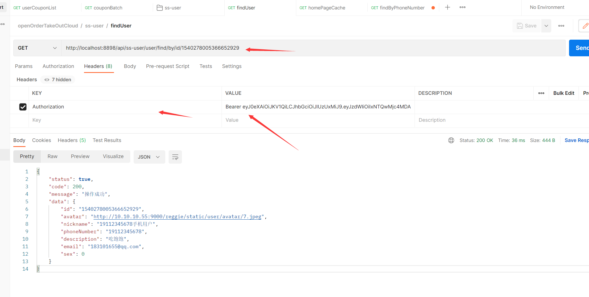

# 用户微服务搭建

## 用户管理接口

- 用户对象等 Bean 已在 common 准备好，不用再手动去做了

#### 创建 持久层 接口 Mapper

```
package top.starshine.mapper;

import com.baomidou.mybatisplus.core.mapper.BaseMapper;
import top.starshine.commons.entity.user.User;


/**
 * 用户 Do 层接口
 * @author: starshine
 * @version: 1.0
 * @since: 2022/6/22  下午 6:14  周三
 * @Description:
 */
public interface UserMapper extends BaseMapper<User> {

}
```

#### 用户服务层接口

```java
package top.starshine.service;

import com.baomidou.mybatisplus.extension.service.IService;
import top.starshine.commons.entity.user.User;

/**
 * 用户服务
 * @author: starshine
 * @version: 1.0
 * @since: 2022/6/22  下午 11:15  周三
 * @Description:
 */
public interface UserService extends IService<User> {


}
```

#### 用户服务层接口实现类

```java
package top.starshine.service.impl;


import com.baomidou.mybatisplus.extension.service.impl.ServiceImpl;
import org.springframework.stereotype.Service;
import top.starshine.commons.entity.user.User;
import top.starshine.commons.model.token.LoadUserDetailService;
import top.starshine.mapper.UserMapper;
import top.starshine.service.UserService;

/**
 * <h3>用户接口</h3>
 * @author: starshine
 * @version: 1.0
 * @since: 2022/6/22  下午 11:16  周三
 * @Description:
 */
@Service
public class UserServiceImpl extends ServiceImpl<UserMapper, User> implements UserService, LoadUserDetailService {

    @Override
    public User getUserById(String id) {
        return getBaseMapper().selectById(id);
    }

}
```

- 这里为什么继承 LoadUserDetailService 令牌拦截器需要读取用户信息

  

#### 创建接口

```java
package top.starshine.controller;

import lombok.RequiredArgsConstructor;
import org.springframework.web.bind.annotation.GetMapping;
import org.springframework.web.bind.annotation.PathVariable;
import top.starshine.commons.aspect.ApiRestController;
import top.starshine.commons.converter.UserConverter;
import top.starshine.commons.entity.user.UserVo;
import top.starshine.service.UserService;

/**
 * <h3>用户管理</h3>
 *
 * @author: starshine
 * @email: 183101655@qq.com
 * @version: 1.0
 * @since: 2022/7/25  下午 3:44  周一
 * @Description: hello world
 */
@RequiredArgsConstructor
@ApiRestController("/user/")
public class UserController {

    private final UserService userService;
    private final UserConverter userConverter;

    // 通过主键查找某个用户
    @GetMapping("find/by/id/{id}")
    public UserVo findById(@PathVariable("id")Long id){
        return userConverter.userToUserVo(userService.getById(id));
    }

    // 通过存入手机号查找用户
    @GetMapping("find/by/PhoneNumber/{id}")
    public UserVo findByPhoneNumber(@PathVariable("id")Long id){
        return null;
    }

}
```

#### PostMan 测试

- 记得携带 Token 

> http://localhost:8898/api/ss-user/user/find/by/id/1540278005366652929



数据模型

```json
{
    "status": true,
    "code": 200,
    "message": "操作成功",
    "data": {
        "id": "1540278005366652929",
        "avatar": "http://10.10.10.55:9000/reggie/static/user/avatar/7.jpeg",
        "nickname": "19112345678手机用户",
        "phoneNumber": "19112345678",
        "description": "吃饱饱",
        "email": "183101655@qq.com",
        "sex": 0
    }
}
```

