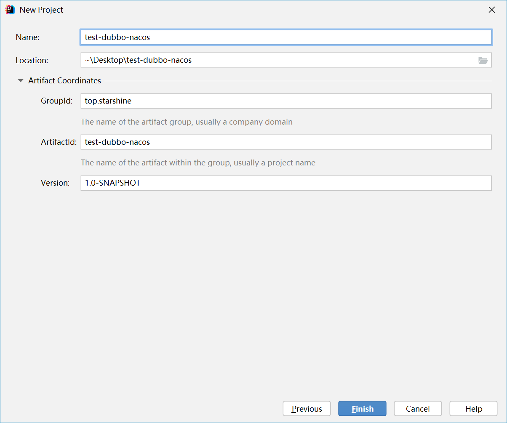
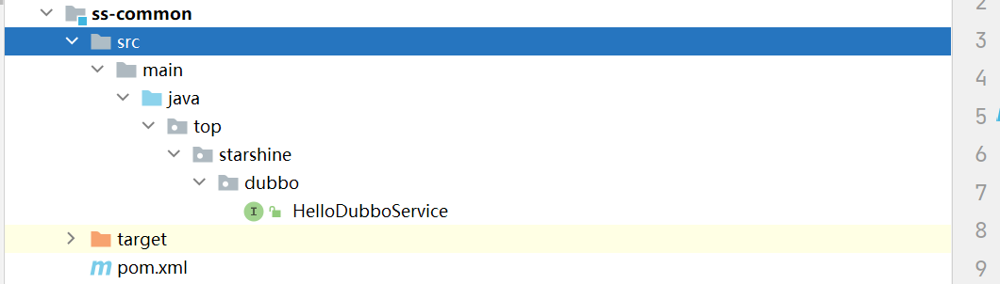
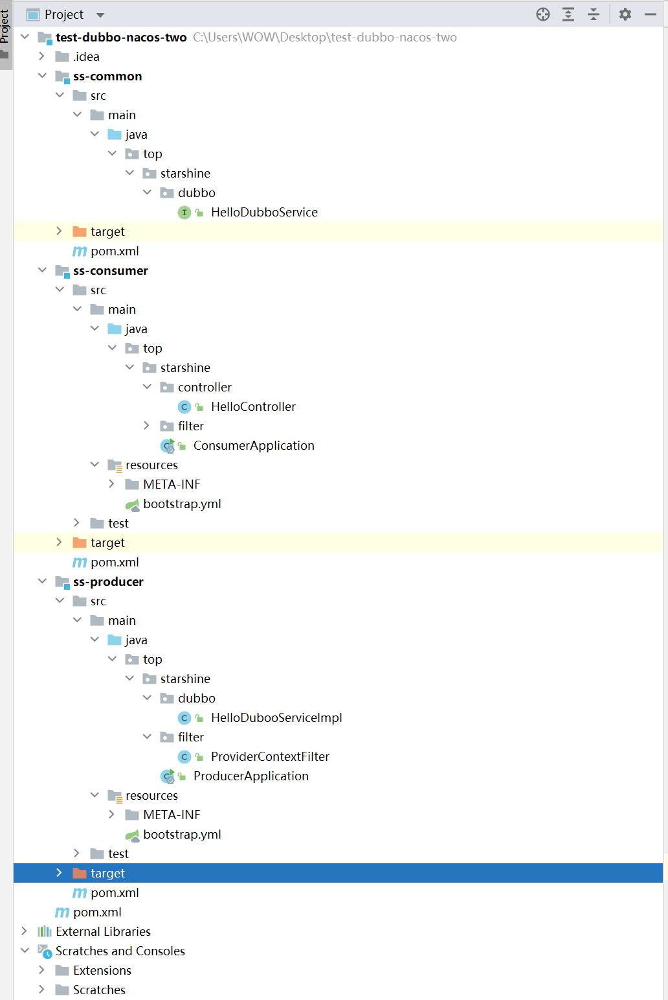
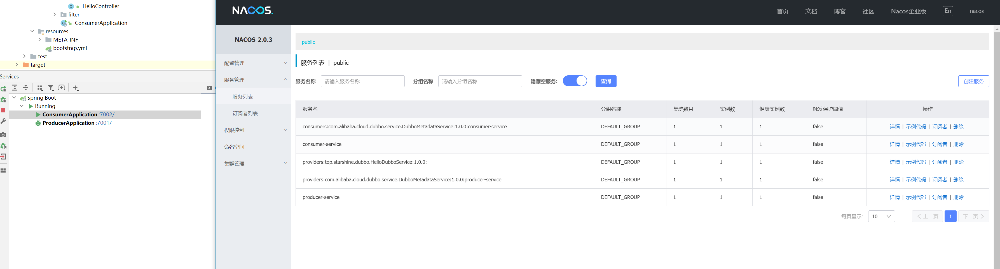
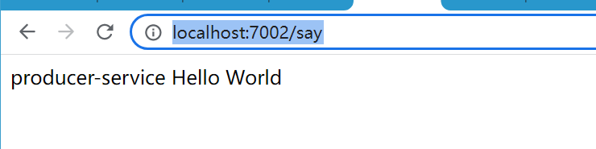

# SpringCloud2微服务Nacos+Dubbo整合

## 前言

> Dubbo 中文官网: https://dubbo.apache.org/zh/
>
> Nacos 中文官网: https://nacos.io/zh-cn/docs/use-nacos-with-dubbo.html

## 创建 Mvaen 父子工程



> 创建完成之后删除目录下的 src 目录即可

## pom.xml 导入包版本

```xml
<?xml version="1.0" encoding="UTF-8"?>
<project xmlns="http://maven.apache.org/POM/4.0.0"
         xmlns:xsi="http://www.w3.org/2001/XMLSchema-instance"
         xsi:schemaLocation="http://maven.apache.org/POM/4.0.0 http://maven.apache.org/xsd/maven-4.0.0.xsd">
    <modelVersion>4.0.0</modelVersion>

    <groupId>top.starshine</groupId>
    <artifactId>test-dubbo-nacos-two</artifactId>
    <packaging>pom</packaging>
    <version>1.0-SNAPSHOT</version>
    <modules>
        <module>ss-producer</module>
        <module>ss-common</module>
        <module>ss-consumer</module>
    </modules>

    <properties>
        <maven.compiler.source>8</maven.compiler.source>
        <maven.compiler.target>8</maven.compiler.target>
    </properties>

    <parent>
        <groupId>org.springframework.boot</groupId>
        <artifactId>spring-boot-starter-parent</artifactId>
        <version>2.5.14</version>
        <!-- lookup parent from repository -->
        <relativePath/>
    </parent>

    <dependencyManagement>
        <dependencies>

            <!--上下文包-->
            <dependency>
                <groupId>com.alibaba.spring</groupId>
                <artifactId>spring-context-support</artifactId>
                <version>1.0.11</version>
            </dependency>

            <dependency>
                <groupId>org.springframework.cloud</groupId>
                <artifactId>spring-cloud-dependencies</artifactId>
                <version>2020.0.5</version>
                <type>pom</type>
                <scope>import</scope>
            </dependency>

            <!--SpringCloudAlibaba还没正式归入到cloud版本里面去,所以需要额外添加-->
            <dependency>
                <groupId>com.alibaba.cloud</groupId>
                <artifactId>spring-cloud-alibaba-dependencies</artifactId>
                <version>2.2.7.RELEASE</version>
                <type>pom</type>
                <scope>import</scope>
            </dependency>

        </dependencies>
    </dependencyManagement>


</project>
```

### 必须检查版本是否正确，否则兼容性导致启动失败

- 已测试 SpringBoot 版本最高 2.5.14， 再高就出现循环依赖
- 已测试 SpringCloud 版本最高 2020.0.5 , 再高就出现循环依赖
- 已测试 AlibabaCloud 版本最高 2.2.7.RELEASE , 再高就出现 dubbo 启动包被移除 ，而且 dubbo 版本还是 2.7.7


## 创建公共模块 ss-common

### 创建测试接口类

```java
package top.starshine.dubbo;

/**
 * <h3></h3>
 *
 * @author: starshine
 * @email: 183101655@qq.com
 * @version: 1.0
 * @since: 2022/7/25  下午 4:52  周一
 * @Description: hello world
 */
public interface HelloDubboService {

    String say();

}
```



### pom.xml 无需要依赖

```xml
<?xml version="1.0" encoding="UTF-8"?>
<project xmlns="http://maven.apache.org/POM/4.0.0"
         xmlns:xsi="http://www.w3.org/2001/XMLSchema-instance"
         xsi:schemaLocation="http://maven.apache.org/POM/4.0.0 http://maven.apache.org/xsd/maven-4.0.0.xsd">
    <parent>
        <artifactId>test-dubbo-nacos-two</artifactId>
        <groupId>top.starshine</groupId>
        <version>1.0-SNAPSHOT</version>
    </parent>
    <modelVersion>4.0.0</modelVersion>

    <artifactId>ss-common</artifactId>

    <properties>
        <maven.compiler.source>8</maven.compiler.source>
        <maven.compiler.target>8</maven.compiler.target>
    </properties>

</project>
```

### 注意

- 必须同包名，路径，同层级，否则无法调用服务

  

## 创建生产者模块 ss-producer

### pom.xml 导入依赖

```xml
<?xml version="1.0" encoding="UTF-8"?>
<project xmlns="http://maven.apache.org/POM/4.0.0"
         xmlns:xsi="http://www.w3.org/2001/XMLSchema-instance"
         xsi:schemaLocation="http://maven.apache.org/POM/4.0.0 http://maven.apache.org/xsd/maven-4.0.0.xsd">
    <parent>
        <artifactId>test-dubbo-nacos-two</artifactId>
        <groupId>top.starshine</groupId>
        <version>1.0-SNAPSHOT</version>
    </parent>
    <modelVersion>4.0.0</modelVersion>

    <artifactId>ss-producer</artifactId>

    <properties>
        <maven.compiler.source>8</maven.compiler.source>
        <maven.compiler.target>8</maven.compiler.target>
    </properties>

    <dependencies>

        <!-- spring Boot web 包  -->
        <dependency>
            <groupId>org.springframework.boot</groupId>
            <artifactId>spring-boot-starter-web</artifactId>
        </dependency>

        <!--公共包-->
        <dependency>
            <groupId>top.starshine</groupId>
            <artifactId>ss-common</artifactId>
            <version>1.0-SNAPSHOT</version>
        </dependency>

        <!--注册中心-->
        <dependency>
            <groupId>com.alibaba.cloud</groupId>
            <artifactId>spring-cloud-starter-alibaba-nacos-discovery</artifactId>
            <!-- 排除 ribbon的依赖 -->
            <exclusions>
                <exclusion>
                    <groupId>org.springframework.cloud</groupId>
                    <artifactId>spring-cloud-starter-netflix-ribbon</artifactId>
                </exclusion>
            </exclusions>
        </dependency>

        <!-- 配置中 nacos -->
        <dependency>
            <groupId>com.alibaba.cloud</groupId>
            <artifactId>spring-cloud-starter-alibaba-nacos-config</artifactId>
        </dependency>

        <!--Dubbo RPC 远程调用 -->
        <dependency>
            <groupId>com.alibaba.cloud</groupId>
            <artifactId>spring-cloud-starter-dubbo</artifactId>
        </dependency>

        <!--最新的 alibabacloud 在加载 bootstrap.yml文件的会报错-->
        <dependency>
            <groupId>org.springframework.cloud</groupId>
            <artifactId>spring-cloud-starter-bootstrap</artifactId>
        </dependency>

        <!--上下文-->
        <dependency>
            <groupId>com.alibaba.spring</groupId>
            <artifactId>spring-context-support</artifactId>
            <version>1.0.11</version>
        </dependency>
        
    </dependencies>

</project>
```

### 创建启动类

```java
package top.starshine;

import org.apache.dubbo.config.spring.context.annotation.EnableDubbo;
import org.springframework.boot.SpringApplication;
import org.springframework.boot.autoconfigure.SpringBootApplication;
import org.springframework.cloud.client.discovery.EnableDiscoveryClient;


/**
 * <h3></h3>
 *
 * @author: starshine
 * @email: 183101655@qq.com
 * @version: 1.0
 * @since: 2022/7/25  下午 4:50  周一
 * @Description: hello world
 */
@EnableDubbo
@EnableDiscoveryClient
@SpringBootApplication
public class ProducerApplication {

    public static void main(String[] args) {
        SpringApplication.run(ProducerApplication.class, args);
        System.out.println("|========================| START OK! |========================|");
    }

}
```

### 接口实现类

```java
package top.starshine.dubbo;

import org.apache.dubbo.config.annotation.DubboService;
import org.springframework.beans.factory.annotation.Value;

/**
 * <h3></h3>
 *
 * @author: starshine
 * @email: 183101655@qq.com
 * @version: 1.0
 * @since: 2022/7/25  下午 4:54  周一
 * @Description: hello world
 */
@DubboService(
        // 集群容错模式
        cluster = "failback",
        // 服务降级
        mock = "return null",
        // 接口类型
        interfaceClass = HelloDubboService.class,
        // 接口名称
        interfaceName = "top.top.starshine.dubbo.HelloDubboService",
        // 接口版本
        version = "1.0.0"
)
public class HelloDubooServiceImpl implements HelloDubboService {

    @Value("${spring.application.name}")
    private String applicationName;

    @Override
    public String say() {
        return applicationName + " Hello World";
    }

}
```

### 配置文件

```yaml
server:
  # 配置端口
  port: 7001

spring:
  application:
    name: producer-service
  #main:
    # Spring Boot2.1及更高的版本需要设定
    #allow-bean-definition-overriding: true
  cloud:
    nacos:
      username: nacos
      password: nacos
      discovery:
        enabled: true
        server-addr: 10.10.10.80:8848
      config:
        server-addr: 10.10.10.80:8848
        #namespace: public
        file-extension: yaml

dubbo:
  config-center:
    address: nacos://10.10.10.80:8848
    username: nacos
    password: nacos
  # 生产者拦截器
  provider:
    filter: providerContextFilter
    # 延迟暴露, 5000 5秒
    #delay: 5000
    # 链接超时
    #timeout:
    #集群容错模式选择
    #cluster: failback
  cloud:
    # 指定需要订阅的服务提供方,默认值 *, 会订阅所有服务, 不建议使用, 多个服务请用逗号隔开
    #配置订阅服务多个服务用,隔开,不配置默认订阅注册中心所有服务, 然后控制台会疯狂警告你指定服务
    subscribed-services: consumer-service
  #application:
    #name: producer-service
    # 禁用QOS同一台机器可能会有端口冲突现象
    #qos-enable: false
    #qos-accept-foreign-ip: false
  registry:
    address: nacos://10.10.10.80:8848
    username: nacos
    password: nacos
    register: true
    subscribe: true
    # 设置超时时间
    #timeout: 3000
  protocol:
    # dubbo 协议
    name: dubbo
    # dubbo 协议端口（ -1 表示自增端口，从 20880 开始）
    port: -1
  scan:
    # 自己向外提供服务的service的包地址,
    # 切记必须要扫描实现类, 而且是当前目录下, 不支持子目录
    base-packages: top.starshine.dubbo
  # 配置元数据中心
  #metadata-report:
    #address: nacos://10.10.10.80:8848
    #username: nacos
    #password: nacos
    # 配置 namespace，有namespace需要指定namespace
    #parameters:
      #namespace: public
    # 配置 隔离组，有配置 group 的需要指定 group
    #group: DEFAULT_GROUP
```


## 消费者端 ss-consumer

### pom.xml 导入依赖

```xml
<?xml version="1.0" encoding="UTF-8"?>
<project xmlns="http://maven.apache.org/POM/4.0.0"
         xmlns:xsi="http://www.w3.org/2001/XMLSchema-instance"
         xsi:schemaLocation="http://maven.apache.org/POM/4.0.0 http://maven.apache.org/xsd/maven-4.0.0.xsd">
    <parent>
        <artifactId>test-dubbo-nacos-two</artifactId>
        <groupId>top.starshine</groupId>
        <version>1.0-SNAPSHOT</version>
    </parent>
    <modelVersion>4.0.0</modelVersion>

    <artifactId>ss-consumer</artifactId>

    <properties>
        <maven.compiler.source>8</maven.compiler.source>
        <maven.compiler.target>8</maven.compiler.target>
    </properties>

    <dependencies>

        <!--公共包-->
        <dependency>
            <groupId>top.starshine</groupId>
            <artifactId>ss-common</artifactId>
            <version>1.0-SNAPSHOT</version>
        </dependency>

        <!-- spring Boot web 包  -->
        <dependency>
            <groupId>org.springframework.boot</groupId>
            <artifactId>spring-boot-starter-web</artifactId>
        </dependency>

        <!--注册中心-->
        <dependency>
            <groupId>com.alibaba.cloud</groupId>
            <artifactId>spring-cloud-starter-alibaba-nacos-discovery</artifactId>
            <!-- 排除 ribbon的依赖 -->
            <exclusions>
                <exclusion>
                    <groupId>org.springframework.cloud</groupId>
                    <artifactId>spring-cloud-starter-netflix-ribbon</artifactId>
                </exclusion>
            </exclusions>
        </dependency>

        <!-- 配置中 nacos -->
        <dependency>
            <groupId>com.alibaba.cloud</groupId>
            <artifactId>spring-cloud-starter-alibaba-nacos-config</artifactId>
        </dependency>

        <!--Dubbo RPC 远程调用 -->
        <dependency>
            <groupId>com.alibaba.cloud</groupId>
            <artifactId>spring-cloud-starter-dubbo</artifactId>
        </dependency>

        <!--最新的 alibabacloud 在加载 bootstrap.yml文件的会报错-->
        <dependency>
            <groupId>org.springframework.cloud</groupId>
            <artifactId>spring-cloud-starter-bootstrap</artifactId>
        </dependency>

        <!--上下文-->
        <dependency>
            <groupId>com.alibaba.spring</groupId>
            <artifactId>spring-context-support</artifactId>
            <version>1.0.11</version>
        </dependency>

    </dependencies>

</project>
```

### 创建启动类

```java
package top.starshine;


import org.apache.dubbo.config.spring.context.annotation.EnableDubbo;
import org.springframework.boot.SpringApplication;
import org.springframework.boot.autoconfigure.SpringBootApplication;
import org.springframework.cloud.client.discovery.EnableDiscoveryClient;

/**
 * <h3></h3>
 *
 * @author: starshine
 * @email: 183101655@qq.com
 * @version: 1.0
 * @since: 2022/7/25  下午 5:03  周一
 * @Description: hello world
 */
@EnableDubbo
@EnableDiscoveryClient
@SpringBootApplication
public class ConsumerApplication {

    public static void main(String[] args) {
        SpringApplication.run(ConsumerApplication.class,args);
        System.out.println("|========================| START OK! |========================|");
    }

}
```

### 创建测试接口

```java
package top.starshine.controller;


import org.apache.dubbo.config.annotation.DubboReference;
import org.apache.dubbo.rpc.RpcContext;
import org.springframework.web.bind.annotation.GetMapping;
import org.springframework.web.bind.annotation.RestController;
import top.starshine.dubbo.HelloDubboService;

/**
 * <h3></h3>
 *
 * @author: starshine
 * @email: 183101655@qq.com
 * @version: 1.0
 * @since: 2022/7/25  下午 5:05  周一
 * @Description: hello world
 */
@RestController
public class HelloController {

    @DubboReference(cluster = "failback",
                    interfaceClass = HelloDubboService.class,
                    interfaceName = "top.top.starshine.dubbo.HelloDubboService",
                    version = "1.0.0")
    private HelloDubboService helloDubboService;

    @GetMapping("/say")
    public String say(){
        return helloDubboService.say();
    }

}
```

### 配置文件

```yaml
server:
  # 配置端口
  port: 7002

spring:
  application:
    name: consumer-service
  main:
    # Spring Boot2.1及更高的版本需要设定
    allow-bean-definition-overriding: true
  cloud:
    nacos:
      username: nacos
      password: nacos
      discovery:
        enabled: true
        server-addr: 10.10.10.80:8848
      config:
        server-addr: 10.10.10.80:8848
        file-extension: yaml

dubbo:
  # 消费者拦截器
  consumer:
    filter: consumerContextFilter
    # 启动时关闭检查是否有生产者服务, 默认 true
    check: false
    # 全局配置延迟链接, 默认 false
    lazy: true
    # 链接超时
    #timeout:
    #集群容错模式选择
    #cluster: failback
  cloud:
    # 指定需要订阅的服务提供方,默认值 *, 会订阅所有服务, 不建议使用, 多个服务请用逗号隔开
    #配置订阅服务多个服务用,隔开,不配置默认订阅注册中心所有服务, 然后控制台会疯狂警告你指定服务
    subscribed-services: producer-service
  #application:
    #name: consumer-service
    # 禁用QOS同一台机器可能会有端口冲突现象
    #qos-enable: false
    #qos-accept-foreign-ip: false
  #registry:
    #address: nacos://10.10.10.80:8848
    #username: nacos
    #password: nacos
    # 设置超时时间
    #timeout: 3000
  protocol:
    # dubbo 协议
    name: dubbo
    # dubbo 协议端口（ -1 表示自增端口，从 20880 开始）
    port: -1
  scan:
    # 扫描 rpc 接口定义包
    base-packages: top.starshine.dubbo
  # 配置元数据中心
  #metadata-report:
    #address: nacos://10.10.10.80:8848
    #username: nacos
    #password: nacos
    # 配置 namespace，有namespace需要指定namespace
    #parameters:
      #namespace: public
    # 配置 隔离组，有配置 group 的需要指定 group
    #group: DEFAULT_GROUP
```

## 整个目录结构如图




## 启动生产者和消费



## 浏览器访问 

> http://localhost:7002/say




