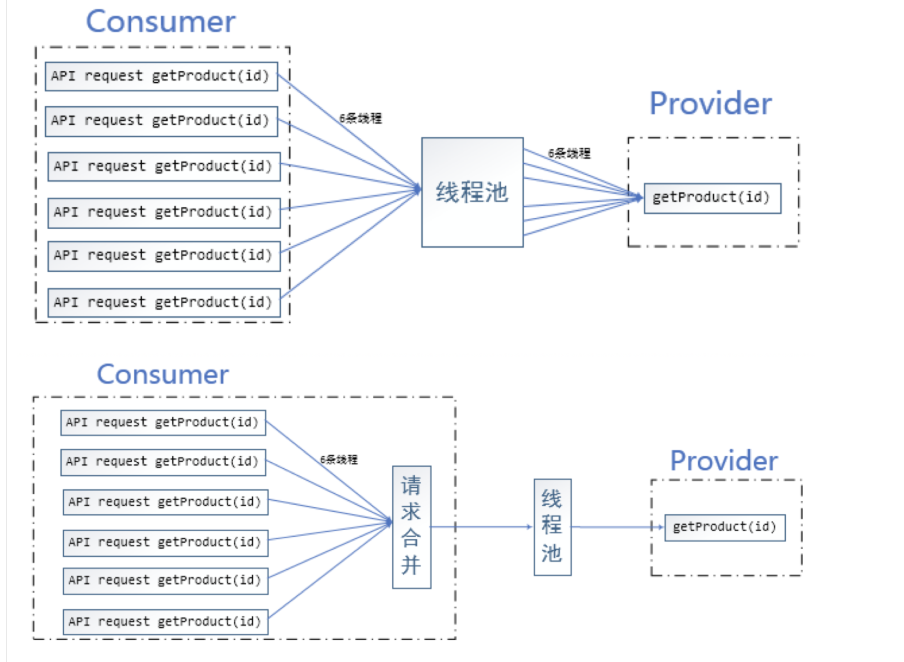
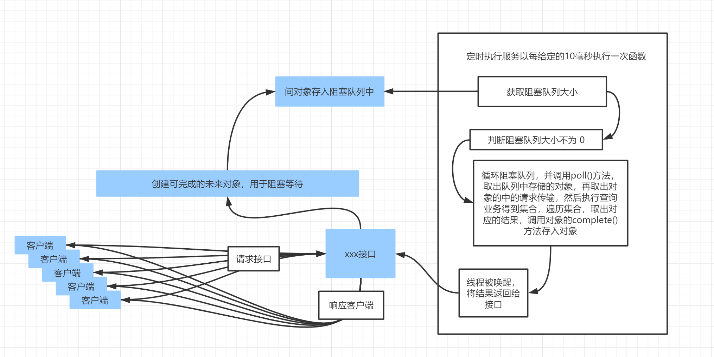
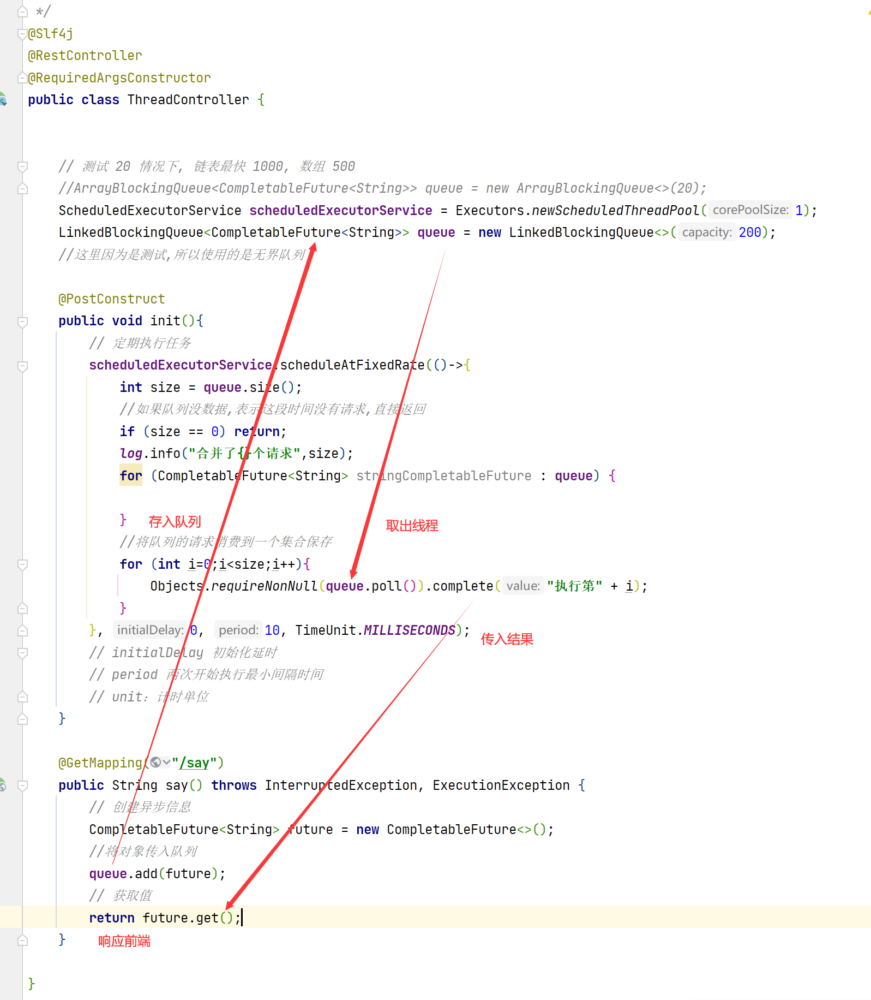
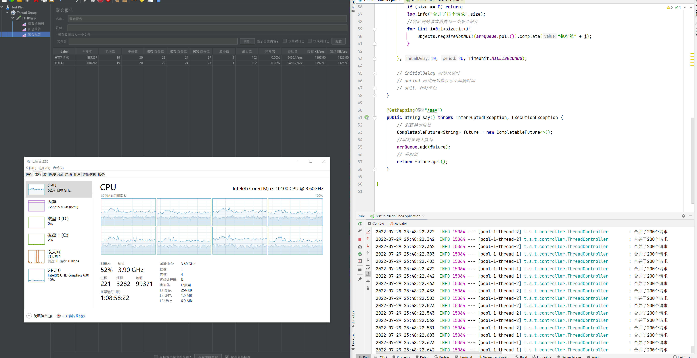

# 是什么请求合并

## 线程池处理

未使用请求合前，客户端请求都是调用一个线程去处理，这样每个线程都是独立处理自己的业务。但是因为每个接口都是一个请求一个线程处理，导致一个线程查询数据库都是一次网络处理。这样线程有多少，数据库就要处理多少条操作。




## 请求合并

针对一个接口，用一个固定频率定时器和阻塞队列，存入固定时间的内的客户端的请求。当达到给定的定时器时间执行开始。循环取出阻塞队列中的请求，取出它们请求参数，进行批量查询操作等。这样一来，数据库只需要在固定频率间网络请求处理，可以大幅度地减少网络之间传输时间，还可以减少数据库压力。

## 实现的原理





### 实现代码

```java
import lombok.RequiredArgsConstructor;
import lombok.extern.slf4j.Slf4j;
import org.springframework.web.bind.annotation.GetMapping;
import org.springframework.web.bind.annotation.RestController;

import javax.annotation.PostConstruct;
import java.util.Objects;
import java.util.concurrent.*;

/**
 * <h3></h3>
 *
 * @author: starshine
 * @email: 183101655@qq.com
 * @version: 1.0
 * @since: 2022/7/29  下午 9:51  周五
 * @Description: hello world
 */
@Slf4j
@RestController
@RequiredArgsConstructor
public class ThreadController {
	/**定时器*/
    ScheduledExecutorService scheduledExecutorService = Executors.newScheduledThreadPool(1);
    /**队列*/
    LinkedBlockingQueue<CompletableFuture<String>> queue = new LinkedBlockingQueue<>(200);

    @PostConstruct
    public void init(){
        // 定期执行任务
        scheduledExecutorService.scheduleAtFixedRate(()->{
            int size = queue.size();
            //如果队列没数据,表示这段时间没有请求,直接返回
            if (size == 0) return;
            //将队列的请求消费到一个集合保存
            for (int i=0;i<size;i++){
                Objects.requireNonNull(queue.poll()).complete("执行第" + i);
            }
        }, 0, 10, TimeUnit.MILLISECONDS);
        // initialDelay 初始化延时, period 两次开始执行最小间隔时间, unit：计时单位
    }

    @GetMapping("/say")
    public String say() throws InterruptedException, ExecutionException {
        // 创建异步信息
        CompletableFuture<String> future = new CompletableFuture<>();
        //将对象传入队列
        queue.add(future);
        // 获取值
        return future.get();
    }

}
```

## 使用Jmeter测试



